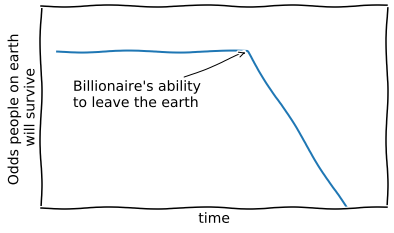

## [Python](#Python "Recent Python projects")

| [GeoPandas](#GeoPandas) | [Matplotlib](#Matplotlib) | [Pandas](#Pandas)  | Arcpy | Sodapy | 
| --- | --- | --- | --- | --- |
|    |  |  |  |  |

## [JavaScript](#JavaScript "Recent JavaScript projects") | [Markdown](#Markdown "Recent Markdown projects") | [HTML](#HTML "Read about my HTML experience")

#### Databases
 SQL
| SQLite
| MySQL
| SQL Server
| PL/SQL
| IMS

#### Cloud Environments
 JupyterLab
| GitPages
| ArcOnline

# Python 
Returning to programming has been a fun and challenging adventure. After some research, learning Python seemed like a good place to start. I dove right in by taking the Python.org [tutorial](https://docs.python.org/3/tutorial/index.html), then reading [Learning Python](https://learning-python.com/) by Mark Lutz. It's an immersive and dense book... and I loved reading it! As of this writing, I'm up to page 936. To get a different perspective and some hands on practice, I completed the University of Helsinki's [Geo-Python course](https://geo-python-site.readthedocs.io/en/latest/). What a wild ride! This tutorial is one of my all-time favorites. It's packed with knowledge, and can be VERY challenging. This course started by teaching me to use JupyterLab and GitHub. These technologies together seemed like the pot at the end of the rainbow for a continuing learner like me. I was so excited to share this new-found knowledge, I wrote a short manual on how to use the two technologies together: **[How to use GitHub without getting Git](assets/HOWTOUSEGITHUBWITHOUTGETTINGGIT.html)**. I'm currently taking the second course in the series [Automating GIS Processes](https://autogis-site.readthedocs.io/en/latest/). More on this soon.  
**Python Examples**  
 **[list comprehensions](https://nbviewer.jupyter.org/github/gis3dts/Portfolio/blob/gh-pages/NOAA_file_parser.ipynb)**

# Pandas 
This is from a Pittsburgh weather data project. It's an example of various chart color options.  

  

# GeoPandas 
These are plots of Pittsburgh Census blocks and geographic codes from a neighborhood inequity project that I'm developing.  

# JavaScript  
After ECMAScript 6 came out, I spent a few months reacquainting myself with the changes to JavaScript. I began reading [Eloquent JavaScript](https://eloquentjavascript.net/) by Marijn Haverbeke. This book is excellent and very hard. At the time (early 2017) the third edition was still in development and it felt like the cutting edge. To get a different perspective (and immediate gratification), I started reading some of the Mozilla Developers Network (MDN) [JavaScript documentation](https://developer.mozilla.org/en-US/docs/Web/JavaScript) and taking some of the cool [tutorials](https://developer.mozilla.org/en-US/docs/Learn/JavaScript/Objects/Object_building_practice) which I plan to revisit for this portfolio.  

**JavaScript Examples**   
**[Simple API](assets/fetch.html)** (Note: This API worked like a charm the first few days, and then somehow it went over the download limit (maybe). Not sure if this is because I never signed up for the service officially, or because this API points to a beta database, and the developers are making changes. Either way, at some point, I'll put the console logs on the site so you can enjoy the error messages. Until then... try hitting ctrl + shift + I, and then find the console tab to see the messages.)

# Markdown  
I'd never heard of the Markdown language before exploring GitHub. It's easy to learn and use, but was frustrating early-on because of sparse options compared to HTML. Since then it's become clear that limited control keeps documents consistent and clean. It's hard to make a Markdown document look bad, but I'm still trying :).

Check out the Markdown documents for the CMS project I'm developing. (coming soon)

# HTML  
Ah what can I say... I can still code a basic HTML page from memory. My knowledge of HTML has helped me with a few projects recently, including anchor tags for this document. It was also a part of quickly completing this JavaScript API call.

# Matplotlib 
These are all my creation from recent projects. The data in the Low Access bar chart is test data (for now) and the meme is anecdotal, the rest use real data.  

