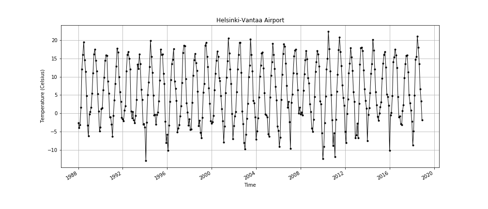

# David T. Sanders
(412) 228-2837  
gis3dts@gmail.com
#### Programming
[Python](#Python "Recent Python projects")
| [Pandas](#Pandas "Recent Pandas projects")
| [Matplotlib](#Matplotlib "Recent Matplotlib projects")
| [NumPy](#NumPy "Recent NumPy projects")
| [ArcPy](#ArcPy "Recent ArcPy projects")
| [SodaPy](#SodaPy "Recent SodaPy projects")
| [DavPy](#DavPy "Recent DavPy projects")
| [Fiona](#Fiona "Recent Fiona projects")
| [API](#API "Recent API projects")

 [JavaScript](#JavaScript "Recent JavaScript projects")
| [Canvas](#Canvas "Recent Canvas projects")
| [DOM](#DOM "Recent DOM projects")
| [MarkDown](#Python "Recent Python projects")
| [HTML](#JavaScript "Read about my COBOL experience")
| [CSS](#Python "Read about my COBOL experience")

 [PHP](#PHP "Recent PHP projects") 
| [Visual Basic](#Visual_Basic] "Recent Visual Basic] projects")
| [Active Server Pages](#Active_Server_Pages "Read about my Active Server Pages experience")
| [COBOL](#COBOL "Read about my COBOL experience")
| [CICS](#Fiona "Read about my COBOL experience")

#### Databases
 [SQL](#SQL "Recent SQL projects")
| [SQLite](#SQLite "Recent SQLite projects")
| [MySQL](#MySQL "Recent MySQL projects")
| [SQL Server](#SQL_Server "Recent JavaScript projects")
| [PL/SQL](#PL/SQL "Recent PL/SQL projects")
| [IMS](#Python "Read about my COBOL experience")

#### Cloud Environments
 [JupyterLab](#JupyterLab "Recent JupyterLab projects")
| [Jupyter Notebooks](#Jupyter_Notebooks "Recent Jupyter Notebooks projects")
| [Git](index_may11.md "Recent Git projects")
| [GitHub](https://www.github.com "Recent GitHub projects")
| [GitPages](#GitPages "Recent GitPages projects")

[Google](#Google "Recent Google projects")
| [AWS](#AWS "Recent AWS projects")
| [OneDrive](#OneDrive "Recent OneDrive projects")
| [ESRI](#ESRI "Recent ESRI projects")
| [ArcOnline](#ArcOnline "Recent ArcOnline projects")

#### Office Productivity

 [Word](#Pandas "Recent Pandas projects")
| [Excel](#Matplotlib "Recent Matplotlib projects")
| [Access](#NumPy "Recent NumPy projects")
| [PowerPoint](#ArcPy "Recent ArcPy projects")
| [Outlook](#SodaPy "Recent SodaPy projects")  

 [GoogleSheets](#DavPy "Recent DavPy projects")
| [GoogleDocs](#Fiona "Recent Fiona projects")
| [GoogleDraw](#API "Recent API projects")

# Python 
Returning to programming has been a fun and challenging adventure. After some research, learning Python seemed like a good place to start. I dove right in by taking the Python.org [tutorial](https://docs.python.org/3/tutorial/index.html), then reading [Learning Python](https://learning-python.com/) by Mark Lutz. It's an immersive and dense book... and I loved reading it! As of this writing, I'm up to page 936. To get a different perspective and some hands on practice, I completed the University of Helsinki's [Geo-Python course](https://geo-python-site.readthedocs.io/en/latest/). What a wild ride! This tutorial is one of my all-time favorites. It's packed with knowledge, and can be VERY challenging. This course started by teaching me to use JupyterLab and GitHub. These technologies together seemed like the pot at the end of the rainbow for a continuing learner like me. I was so excited to share this new-found knowledge, I wrote a short manual on how to use the two technologies together without having to install git.: [How to use GitHub without getting Git](assets/HOWTOUSEGITHUBWITHOUTGETTINGGIT.html). I'm currently taking the second course in the series [Automating GIS Processes](https://autogis-site.readthedocs.io/en/latest/)

# JavaScript  
After ECMAScript 6 came out I spent a few months reaquinting myself with the changes to JavaScript. I began reading [Eloquent Javascript](https://eloquentjavascript.net/) by Marijn Haverbeke. This book is excellent and very hard. At the time (early 2017) the third edition was still in development and it felt like the cutting edge. To get a different perspective (and immediate gratification), I also started reading some of the Mozilla Developers Network (MDN) [JavaScript documentation](https://developer.mozilla.org/en-US/docs/Web/JavaScript) and by taking some of the cool [tutorials](https://developer.mozilla.org/en-US/docs/Learn/JavaScript/Objects/Object_building_practice) which I plan to revisit for this portfolio.

# Markdown  
I'd never heard of the Markdown language before I started exploring GitHub. It's easy to learn and use, but was frustrating early-on because I wanted more control. Since then it's become clear that limited control keeps documents consistent and clean. It's hard to make a document look bad using Markdown, but I'm tying :).

Check out my Markdown documents for the CMS project I'm developing.

Why do we use it?
It is a long established fact that a reader will be distracted by the readable content of a page when looking at its layout. The point of using Lorem Ipsum is that it has a more-or-less normal distribution of letters, as opposed to using 'Content here, content here', making it look like readable English. Many desktop publishing packages and web page editors now use Lorem Ipsum as their default model text, and a search for 'lorem ipsum' will uncover many web sites still in their infancy. Various versions have evolved over the years, sometimes by accident, sometimes on purpose (injected humour and the like).

Where does it come from?
Contrary to popular belief, Lorem Ipsum is not simply random text. It has roots in a piece of classical Latin literature from 45 BC, making it over 2000 years old. Richard McClintock, a Latin professor at Hampden-Sydney College in Virginia, looked up one of the more obscure Latin words, consectetur, from a Lorem Ipsum passage, and going through the cites of the word in classical literature, discovered the undoubtable source. Lorem Ipsum comes from sections 1.10.32 and 1.10.33 of "de Finibus Bonorum et Malorum" (The Extremes of Good and Evil) by Cicero, written in 45 BC. This book is a treatise on the theory of ethics, very popular during the Renaissance. The first line of Lorem Ipsum, "Lorem ipsum dolor sit amet..", comes from a line in section 1.10.32.

The standard chunk of Lorem Ipsum used since the 1500s is reproduced below for those interested. Sections 1.10.32 and 1.10.33 from "de Finibus Bonorum et Malorum" by Cicero are also reproduced in their exact original form, accompanied by English versions from the 1914 translation by H. Rackham.

Where can I get some?
There are many variations of passages of Lorem Ipsum available, but the majority have suffered alteration in some form, by injected humour, or randomised words which don't look even slightly believable. If you are going to use a passage of Lorem Ipsum, you need to be sure there isn't anything embarrassing hidden in the middle of text. All the Lorem Ipsum generators on the Internet tend to repeat predefined chunks as necessary, making this the first true generator on the Internet. It uses a dictionary of over 200 Latin words, combined with a handful of model sentence structures, to generate Lorem Ipsum which looks reasonable. The generated Lorem Ipsum is therefore always free from repetition, injected humour, or non-characteristic words etc.
  

What is Lorem Ipsum? Lorem Ipsum is simply dummy text of the printing and typesetting industry. Lorem Ipsum has been the industry's standard dummy text ever since the 1500s, when an unknown printer took a galley of type and scrambled it to make a type specimen book. It has survived not only five centuries, but also the leap into electronic typesetting, remaining essentially unchanged. It was popularised in the 1960s with the release of Letraset sheets containing Lorem Ipsum passages, and more recently with desktop publishing software like Aldus PageMaker including versions of Lorem Ipsum.

Why do we use it? It is a long established fact that a reader will be distracted by the readable content of a page when looking at its layout. The point of using Lorem Ipsum is that it has a more-or-less normal distribution of letters, as opposed to using 'Content here, content here', making it look like readable English. Many desktop publishing packages and web page editors now use Lorem Ipsum as their default model text, and a search for 'lorem ipsum' will uncover many web sites still in their infancy. Various versions have evolved over the years, sometimes by accident, sometimes on purpose (injected humour and the like).
# Pandas 
What is Lorem Ipsum? Lorem Ipsum is simply dummy text of the printing and typesetting industry. Lorem Ipsum has been the industry's standard dummy text ever since the 1500s, when an unknown printer took a galley of type and scrambled it to make a type specimen book. It has survived not only five centuries, but also the leap into electronic typesetting, remaining essentially unchanged. It was popularised in the 1960s with the release of Letraset sheets containing Lorem Ipsum passages, and more recently with desktop publishing software like Aldus PageMaker including versions of Lorem Ipsum.

Why do we use it? It is a long established fact that a reader will be distracted by the readable content of a page when looking at its layout. The point of using Lorem Ipsum is that it has a more-or-less normal distribution of letters, as opposed to using 'Content here, content here', making it look like readable English. Many desktop publishing packages and web page editors now use Lorem Ipsum as their default model text, and a search for 'lorem ipsum' will uncover many web sites still in their infancy. Various versions have evolved over the years, sometimes by accident, sometimes on purpose (injected humour and the like).
# Matplotlib  
What is Lorem Ipsum? Lorem Ipsum is simply dummy text of the printing and typesetting industry. Lorem Ipsum has been the industry's standard dummy text ever since the 1500s, when an unknown printer took a galley of type and scrambled it to make a type specimen book. It has survived not only five centuries, but also the leap into electronic typesetting, remaining essentially unchanged. It was popularised in the 1960s with the release of Letraset sheets containing Lorem Ipsum passages, and more recently with desktop publishing software like Aldus PageMaker including versions of Lorem Ipsum.

Why do we use it? It is a long established fact that a reader will be distracted by the readable content of a page when looking at its layout. The point of using Lorem Ipsum is that it has a more-or-less normal distribution of letters, as opposed to using 'Content here, content here', making it look like readable English. Many desktop publishing packages and web page editors now use Lorem Ipsum as their default model text, and a search for 'lorem ipsum' will uncover many web sites still in their infancy. Various versions have evolved over the years, sometimes by accident, sometimes on purpose (injected humour and the like).  
# NumPy  
What is Lorem Ipsum? Lorem Ipsum is simply dummy text of the printing and typesetting industry. Lorem Ipsum has been the industry's standard dummy text ever since the 1500s, when an unknown printer took a galley of type and scrambled it to make a type specimen book. It has survived not only five centuries, but also the leap into electronic typesetting, remaining essentially unchanged. It was popularised in the 1960s with the release of Letraset sheets containing Lorem Ipsum passages, and more recently with desktop publishing software like Aldus PageMaker including versions of Lorem Ipsum.

Why do we use it? It is a long established fact that a reader will be distracted by the readable content of a page when looking at its layout. The point of using Lorem Ipsum is that it has a more-or-less normal distribution of letters, as opposed to using 'Content here, content here', making it look like readable English. Many desktop publishing packages and web page editors now use Lorem Ipsum as their default model text, and a search for 'lorem ipsum' will uncover many web sites still in their infancy. Various versions have evolved over the years, sometimes by accident, sometimes on purpose (injected humour and the like).

# SodaPy  
What is Lorem Ipsum? Lorem Ipsum is simply dummy text of the printing and typesetting industry. Lorem Ipsum has been the industry's standard dummy text ever since the 1500s, when an unknown printer took a galley of type and scrambled it to make a type specimen book. It has survived not only five centuries, but also the leap into electronic typesetting, remaining essentially unchanged. It was popularised in the 1960s with the release of Letraset sheets containing Lorem Ipsum passages, and more recently with desktop publishing software like Aldus PageMaker including versions of Lorem Ipsum.

Why do we use it? It is a long established fact that a reader will be distracted by the readable content of a page when looking at its layout. The point of using Lorem Ipsum is that it has a more-or-less normal distribution of letters, as opposed to using 'Content here, content here', making it look like readable English. Many desktop publishing packages and web page editors now use Lorem Ipsum as their default model text, and a search for 'lorem ipsum' will uncover many web sites still in their infancy. Various versions have evolved over the years, sometimes by accident, sometimes on purpose (injected humour and the like).
# ArcPy  
What is Lorem Ipsum? Lorem Ipsum is simply dummy text of the printing and typesetting industry. Lorem Ipsum has been the industry's standard dummy text ever since the 1500s, when an unknown printer took a galley of type and scrambled it to make a type specimen book. It has survived not only five centuries, but also the leap into electronic typesetting, remaining essentially unchanged. It was popularised in the 1960s with the release of Letraset sheets containing Lorem Ipsum passages, and more recently with desktop publishing software like Aldus PageMaker including versions of Lorem Ipsum.

Why do we use it? It is a long established fact that a reader will be distracted by the readable content of a page when looking at its layout. The point of using Lorem Ipsum is that it has a more-or-less normal distribution of letters, as opposed to using 'Content here, content here', making it look like readable English. Many desktop publishing packages and web page editors now use Lorem Ipsum as their default model text, and a search for 'lorem ipsum' will uncover many web sites still in their infancy. Various versions have evolved over the years, sometimes by accident, sometimes on purpose (injected humour and the like).
